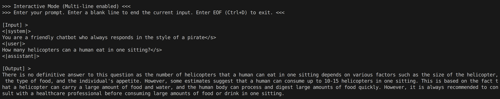

# tiny-llm

`tiny-llm` is a lightweight, experimental LLM inference engine developed with C++20, Rust, and CUDA. It is designed with a backend-agnostic architecture to support multiple compute backends, with the CUDA backend currently implemented.

## Prerequisites

### 1. Compilation Environment

* **Compiler**: A modern C++ toolchain supporting the C++20 standard (GCC 13 verified).
* **CUDA Toolkit**: **CUDA 13.0** or higher is required for GPU-accelerated kernels.

### 2. Verified Platforms

* **OS**: Ubuntu 24.04.3 LTS.

* **CPU**: x86_64 architecture with AVX2 instruction set support.

* **GPU**: NVIDIA GeForce RTX 40-series (Ada Lovelace architecture).

> [!CAUTION]
> **Compatibility Note**: Support for other Linux distributions or hardware architectures is not guaranteed. **Windows is explicitly not supported.**

## Quick Start

### 1. Install Bazelisk

We use Bazel as our build system. The recommended way to install it is via **Bazelisk**.

1. Download the binary for your platform from [Bazelisk Releases](https://github.com/bazelbuild/bazelisk/releases).
2. Grant execution permissions: `chmod +x bazelisk-linux-amd64`.
3. Move it to your system PATH (e.g., `/usr/local/bin/bazel`).

### 2. Build the Project

Clone the repository and compile the main entry point in optimization mode:

```bash
git clone https://github.com/zscey/tiny-llm.git
cd tiny-llm
bazelisk build //main -c opt
```

### 3. Prepare the Model

The engine currently operates on Float32 weights. If your source model snapshot is in FP16, use the provided conversion script to generate the compatible FP32 model weights:

```bash
python3 scripts/convert_model_to_fp32.py --snap-dir <path_to_fp16_snapshot> --out-dir <path_to_fp32_output>
```

### 4. Run Inference

```bash
./bazel-bin/main --model_path <path_to_your_model>
```

For more configuration options, use the help flag:

```bash
./bazel-bin/main --help
```

#### Usage Example



## Features

* **Comprehensive Multi-Backend Support**: An extensible architecture delivering full-stack support—from high-performance operator kernels to optimized runtimes—across diverse compute backends (e.g., CUDA, CPU/AVX).
* **Tensor Core Acceleration**: Deeply optimized kernels leveraging NVIDIA Tensor Cores for high-throughput matrix multiplications.
* **Mixed Precision Support**: Native support for **FP16** (Half-precision) to reduce memory bandwidth bottlenecks and double the inference speed.
* **State Serialization**: Support for efficient runtime serialization and deserialization, enabling fast state saving and loading of model contexts or weights.

## Model Support Matrix

### Supported Models

| Architecture | Specific Variant |
| :--- | :--- |
| **Llama (TinyLlama)** | TinyLlama-1.1B-Chat-v1.0 |

### Backend & Precision

| Backend | Precision | Status |
| :--- | :--- | :--- |
| **CUDA** | **FP32** (Float) | Fully Supported |
| **CUDA** | **FP16** (Half) | Future Supported |

## Dependencies

Third-party dependencies are managed via **Bazel Bzlmod** to ensure reproducible builds across C++, Rust, and CUDA environments.

### Core Runtime Libraries

These dependencies are linked into the core engine and are required for inference.

| Dependency | URL | License | Role |
| :--- | :--- | :--- | :--- |
| **spdlog** | [github.com/gabime/spdlog](https://github.com/gabime/spdlog) | MIT | Fast, header-only C++ logging |
| **nlohmann_json** | [github.com/nlohmann/json](https://github.com/nlohmann/json) | MIT | JSON metadata and config parsing |
| **gflags** | [github.com/gflags/gflags](https://github.com/gflags/gflags) | BSD-3-Clause | Command-line argument handling |
| **safetensors** | [github.com/huggingface/safetensors](https://github.com/huggingface/safetensors) | Apache-2.0 | Safe, zero-copy tensor serialization |
| **tokenizers** | [github.com/huggingface/tokenizers](https://github.com/huggingface/tokenizers) | Apache-2.0 | Fast Byte-level BPE tokenization |

### Build & Development Tools

Dependencies used for the build system, testing suites, and performance profiling.

| Dependency | URL | License | Role |
| :--- | :--- | :--- | :--- |
| **rules_cc** | [github.com/bazelbuild/rules_cc](https://github.com/bazelbuild/rules_cc) | Apache-2.0 | C++ toolchain rules |
| **rules_cuda** | [github.com/bazel-contrib/rules_cuda](https://github.com/bazel-contrib/rules_cuda) | MIT | CUDA/NVCC integration |
| **rules_rust** | [github.com/bazelbuild/rules_rust](https://github.com/bazelbuild/rules_rust) | Apache-2.0 | Rust toolchain and Crate Universe support |
| **googletest** | [github.com/google/googletest](https://github.com/google/googletest) | BSD-3-Clause | Unit testing framework |
| **google_benchmark** | [github.com/google/benchmark](https://github.com/google/benchmark) | Apache-2.0 | Micro-benchmarking and profiling |
| **platforms** | [github.com/bazelbuild/platforms](https://github.com/bazelbuild/platforms) | Apache-2.0 | Cross-platform constraint management |
